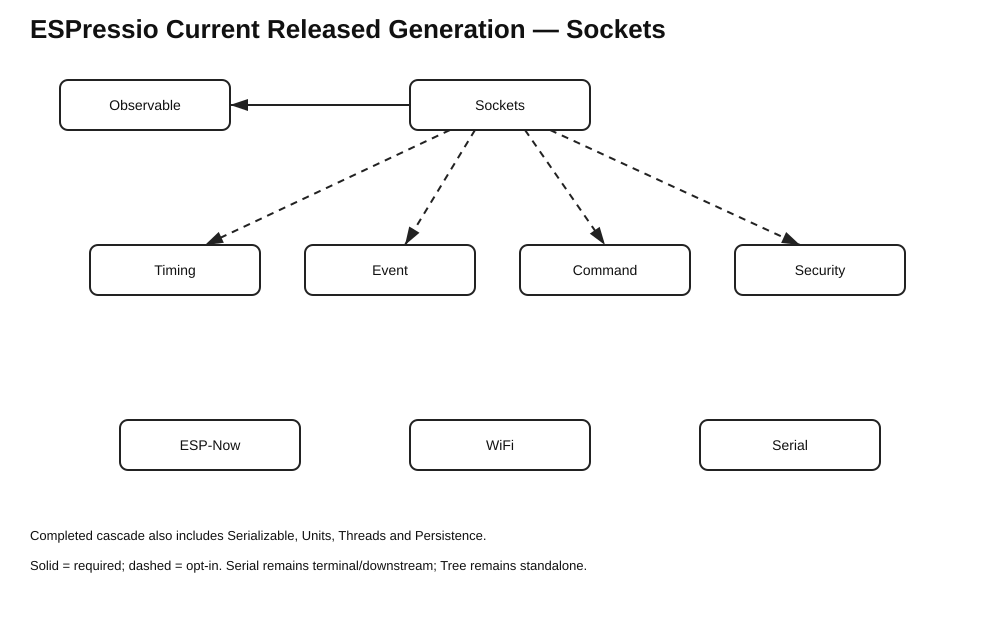

# ESPressio Dependency Chart — Current Released Generation



## Released generation

```text
Observable    3.0.2
Serializable  0.11.3
Units         0.2.7
Timing        2.2.8
Threads       3.1.7
Event         6.0.3
Command       1.0.3
Security      0.4.2
Persistence   0.3.2
Sockets       0.7.3
ESP-Now       0.8.3
WiFi          0.2.0
Serial        0.8.1
```

## Sockets dependency position

```text
Sockets 0.7.3
    -> Observable >= 3.0.2 < 4.0.0

Sockets optional integrations
    - - -> Event >= 6.0.3 < 7.0.0
    - - -> Command >= 1.0.3 < 2.0.0
    - - -> Security >= 0.4.2 < 1.0.0
    - - -> Timing >= 2.2.8 < 3.0.0
```

Observable remains the only required ESPressio dependency of core Sockets. Event, Command, Security and Timing integrations remain opt-in.

## Completed cascade

```text
Serializable 0.11.3
    -> Units 0.2.7
    -> Timing 2.2.8
    -> Threads 3.1.7
    -> Event 6.0.3
    -> Command 1.0.3 / Security 0.4.2
    -> Persistence 0.3.2 / Sockets 0.7.3 / ESP-Now 0.8.3
    -> WiFi 0.2.0
    -> Serial 0.8.1
```

Event has no reverse dependency on Sockets. Serial remains terminal/downstream; ESPressio Tree remains standalone.
